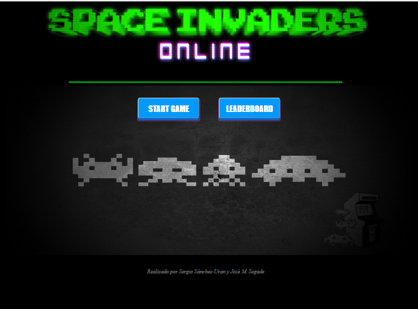
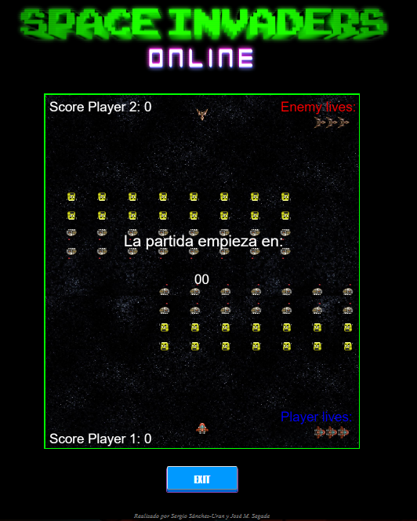
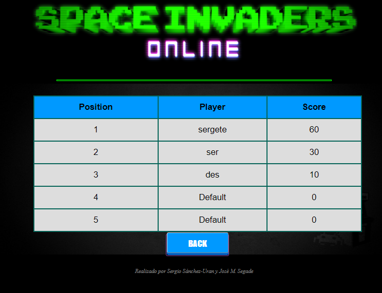
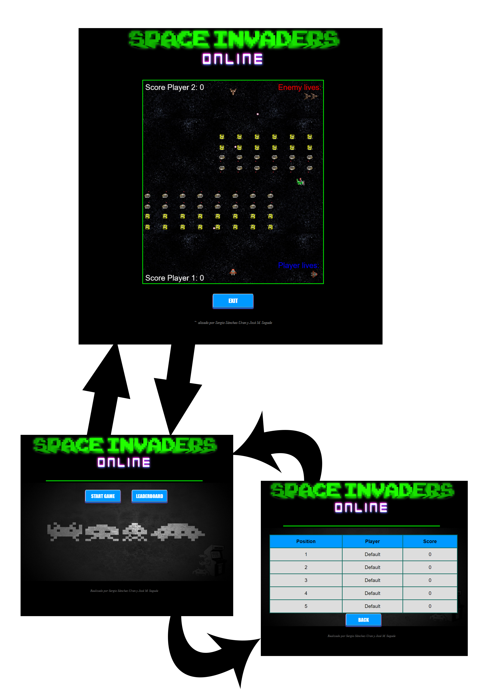

# juegoenred

IMPORTANTE: este documento es el equivalente en texto plano al pdf adjunto con el mismo nombre

Juego de la asignatura Juegos en Red - Grado de Diseño y Desarrollo de Videojuegos (URJC)

----INTEGRANTES----

Sergio Sánchez-Uran López (s.sanchezuran@alumnos.urjc.es - @sergete en github)
José María Segade de Tena (jm.segade@alumnos.urjc.es - @PepeSegade en github)

----FASE 1----

Nombre del Juego: Space Invaders

Descripción: 
Cada jugador aparecerá en la parte inferior de la pantalla, como en el juego clásico, y el oponente aparecerá en en la parte
superior y cruzarán el fuego en el campo de batalla, cada uno tendrá 3 vidas y la batalla acaba bien cuando no queda ningún
alienígena en la pantalla, bien cuando el oponente quede eliminado.
Los jugadores se enfrentan para conseguir la mayor puntuación sin ser eliminados por el oponente.
Es una revisión del clásico juego de Space Invaders adaptado para dos jugadores.

Trello: https://trello.com/b/LvgXmdKU/juego-en-red

----FASE 2----

Páginas de navegación:
Menú. Desde el menú de podrá seleccionar una nueva partida o acceder al panel de puntuaciones.

Juego. En la página de juego se desarrolla el contenido del juego donde se enfrentan los jugadores a través del entorno javascript.

Leaderboard. El panel de puntuaciones contendrá una tabla con los mejores jugadores.

Diagrama de navegación:
Desde el menú se puede ir al juego o a la tabla de puntuaciones, y desde cualquiera de estas páginas se puede volver siempre al menú de nuevo.

Diseño del juego:
Para el diseño del juego se ha escogido como base el juego que provee la página de phaser: http://www.phaser.io/examples/v2/games/invaders. 
Hemos adaptado además un segundo jugador y nuevos tipos de enemigos. 
También se ha creado un nuevo panel de puntuación y una nueva lista de vidas de cada jugador. 
Queremos que el juego esté centrado en la competitividad entre los dos jugadores que se vayan a enfrentar,
por tanto el juego no debe ser lento en ningún momento y ha de estar orientado a que suponga 
cierto nivel de reto para cada uno de los jugadores. 
Hemos optado por una estética que recuerde a las máquinas arcade. 

