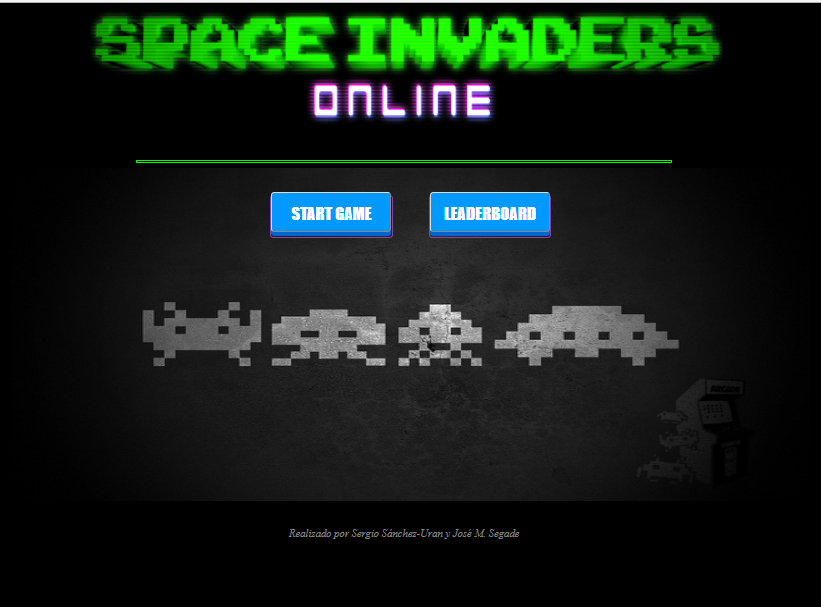
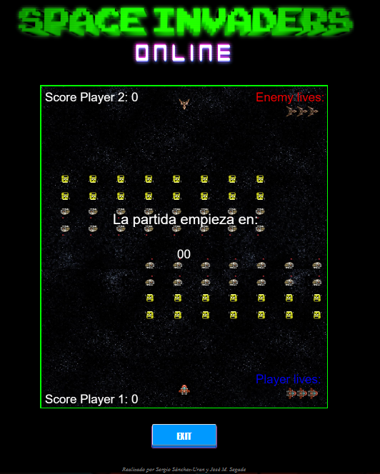
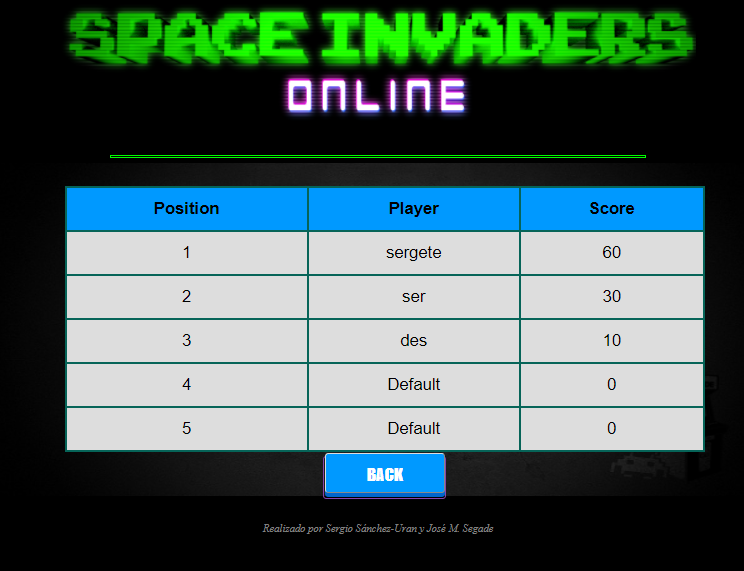
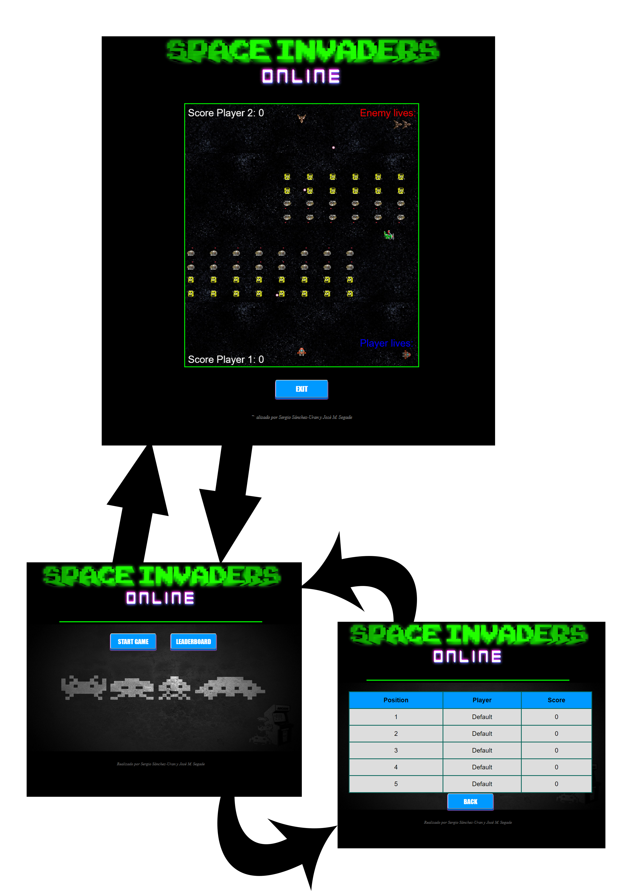
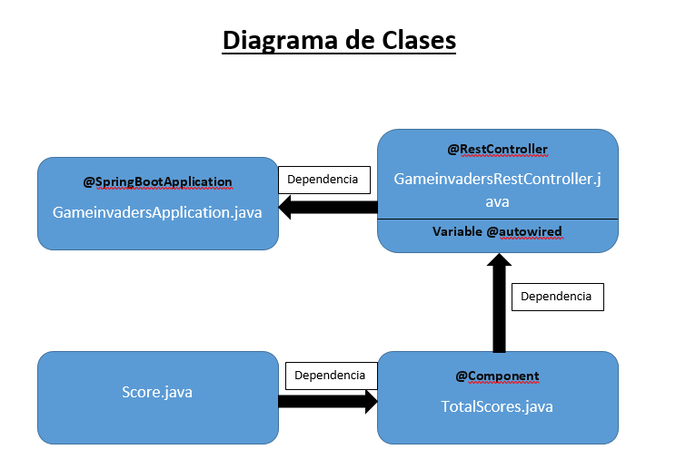
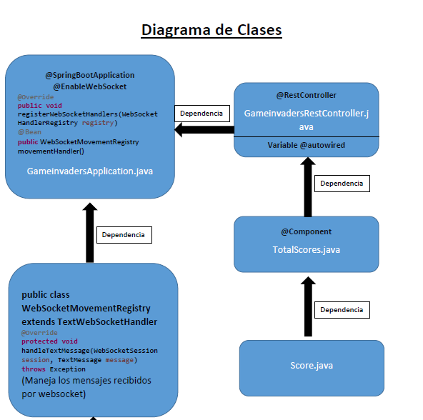
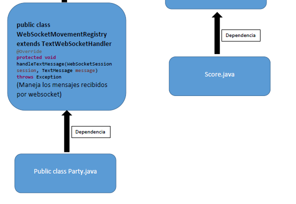

# juegoenred

Enlace a Youtube, video explicativo del funcionamiento del juego Space Invaders
https://youtu.be/a7l5akSZ8kY

IMPORTANTE: este documento es el equivalente en texto plano al pdf adjunto con el mismo nombre

Juego de la asignatura Juegos en Red - Grado de Diseño y Desarrollo de Videojuegos (URJC)

## INTEGRANTES

Sergio Sánchez-Uran López (s.sanchezuran@alumnos.urjc.es - @sergete en github)
José María Segade de Tena (jm.segade@alumnos.urjc.es - @PepeSegade en github)

## FASE 1

Nombre del Juego: Space Invaders

Descripción: 
Cada jugador aparecerá en la parte inferior de la pantalla, como en el juego clásico, y el oponente aparecerá en en la parte
superior y cruzarán el fuego en el campo de batalla, cada uno tendrá 3 vidas y la batalla acaba bien cuando no queda ningún
alienígena en la pantalla, bien cuando el oponente quede eliminado.
Los jugadores se enfrentan para conseguir la mayor puntuación sin ser eliminados por el oponente.
Es una revisión del clásico juego de Space Invaders adaptado para dos jugadores.

Trello: https://trello.com/b/LvgXmdKU/juego-en-red

## FASE 2

Páginas de navegación:
Menú. Desde el menú de podrá seleccionar una nueva partida o acceder al panel de puntuaciones.

Juego. En la página de juego se desarrolla el contenido del juego donde se enfrentan los jugadores a través del entorno javascript.

Leaderboard. El panel de puntuaciones contendrá una tabla con los mejores jugadores.

Diagrama de navegación:
Desde el menú se puede ir al juego o a la tabla de puntuaciones, y desde cualquiera de estas páginas se puede volver siempre al menú de nuevo.

Diseño del juego:
Para el diseño del juego se ha escogido como base el juego que provee la página de phaser: http://www.phaser.io/examples/v2/games/invaders. 
Hemos adaptado además un segundo jugador y nuevos tipos de enemigos. 
También se ha creado un nuevo panel de puntuación y una nueva lista de vidas de cada jugador. 
Queremos que el juego esté centrado en la competitividad entre los dos jugadores que se vayan a enfrentar,
por tanto el juego no debe ser lento en ningún momento y ha de estar orientado a que suponga 
cierto nivel de reto para cada uno de los jugadores. 
Hemos optado por una estética que recuerde a las máquinas arcade. 

## FASE 3

El diagrama de navegación continúa igual que en la fase 2

Diagrama de clases:

Instrucciones precisas para ejecutar la aplicación:

1. Compilar la aplicación en sts-bundle y ejecutar de manera normal en el buscador con localhost:8080
lo que nos llevará a la página de inicio del juego y podremos navegar entre las diferentes pestañas
con los botones habilitados para ello.

2. La otra opción es ejecutar el archivo .jar localizado en la carpeta gameinvaders/target/gameinvaders-0.0.1-SNAPSHOT.jar
   y a continuación en el navegador escribir: localhost:8080 y nos llevará al inicio del juego

## FASE 4

Protocolo:

El protocolo usado es a traves de una conexión WebSockets en el cual se intercambian mensajes por servidor a traves de archivos
JSON. Estos JSON tienen dos campos: uno de tipo, que indica la funcion que se tiene que realizar, otro de parámetros, en el que 
se mandan los datos necesarios para realizar correctamente la función.

* Tipo "ready":
Este mensaje indica que el jugador esta listo para empezar una partida.
El mensaje de cliente a servidor no recibe parámetros.
El servidor activa un flag que permite al jugador encontrar partida.
El servidor devuelve un mensaje con un parámetro booleano que indica si le ha encontrado una partida. Si la encuentra el
cliente ya puede comenzar la partida.
* Tipo "move":
Este mensaje indica la posicion del oponente.
El mensaje de cliente a servidor recibe dos parámetros: la posicion (int posX) del jugador y si ha disparado (bool dis) o no.
El servidor copia el mensaje y se lo reenvia al cliente que ya sabe interpretarlo.
* Tipo "alien":
Este mensaje indica la posicion de la bala cuando dispara un alien.
El mensaje de cliente a servidor recibe dos parámetros: la posicion x del disparo (double coordX) y la posicion y (double coordY).
El servidor copia el mensaje y se lo reenvia al cliente que ya sabe interpretarlo.
* Tipo "alienKill":
Este mensaje indica el alien que el jugador 2 ha matado y actualiza su puntuacion.
El mensaje de cliente a servidor recibe tres parametros: la posicion en el array del alien (int alienPos),
la puntuacion del jugador 2 (int score) y el indice del array del alien que sea (int list).
El servidor copia el mensaje y se lo reenvia al cliente que ya sabe interpretarlo.
* Tipo "vida":
Este mensaje indica que el jugador ha perdido una vida.
El mensaje de cliente a servidor recibe un parametro: se indica si se ha perdido una vida (bool quitar).
El servidor copia el mensaje y se lo reenvia al cliente que ya sabe interpretarlo.
* Tipo "end":
Este mensaje indica que se ha acabado la partida.
El mensaje de cliente a servidor no recibe parámetros.
El servidor resetea las partidas y deja las listas internas de gestión de sesiones lista para 
empezar de nuevo.
El servidor copia el mensaje y se lo reenvia al cliente para informar de que se acabó la partida.

OTROS TIPOS DE MENSAJES: Cuando el jugador se conecta entra automáticamente en las listas internas del
servidor. Cuando se desconecta el servidor le elimina de sus listas, y si estaba en partida,
informa al oponente de que ha perdido la conexión.

Video:

Diagrama de clases:

o puede encontrarlo en pdf dentro de la carpeta Documentation.